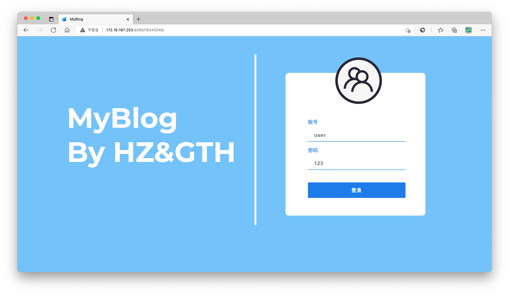
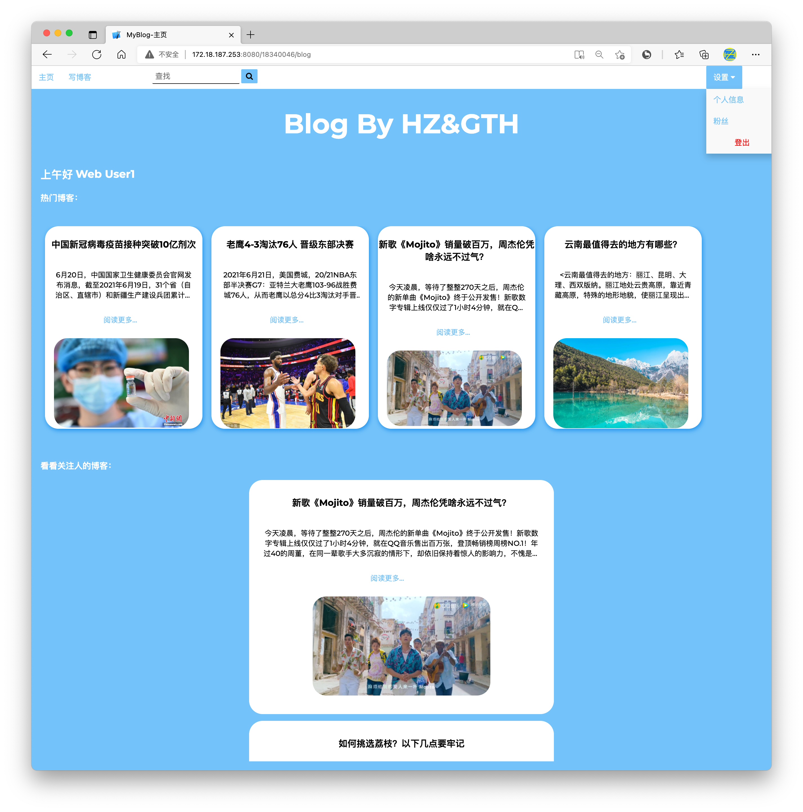
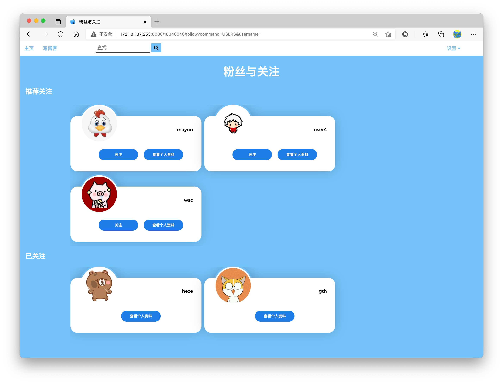
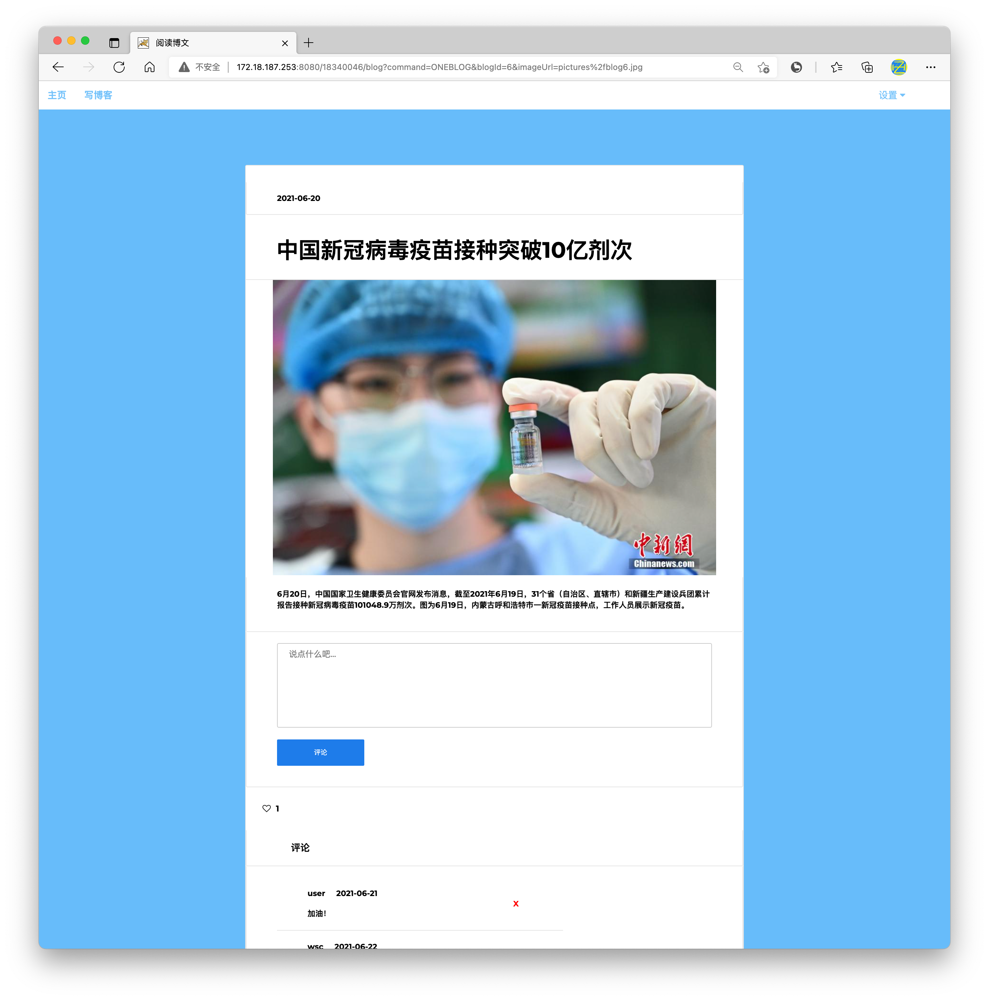
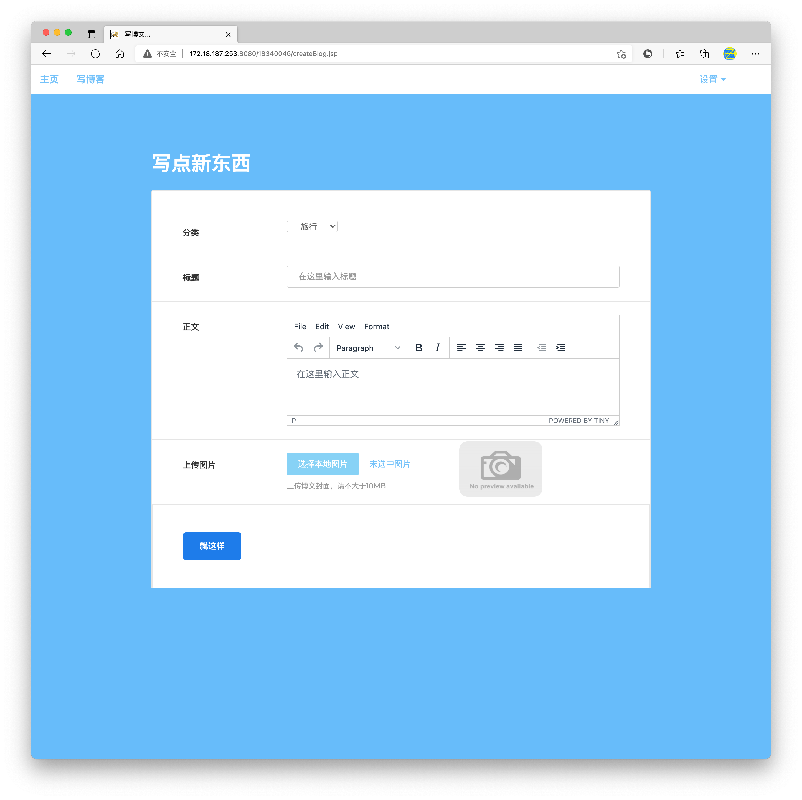
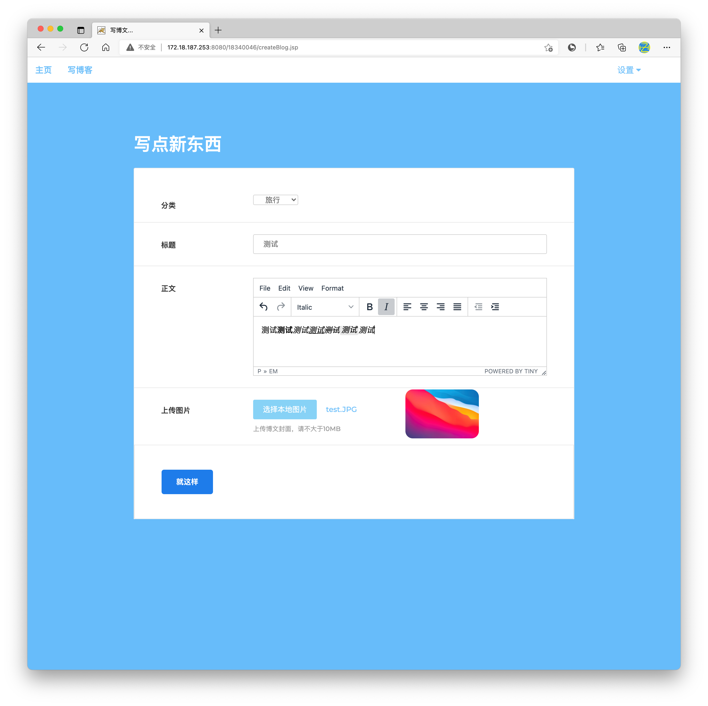
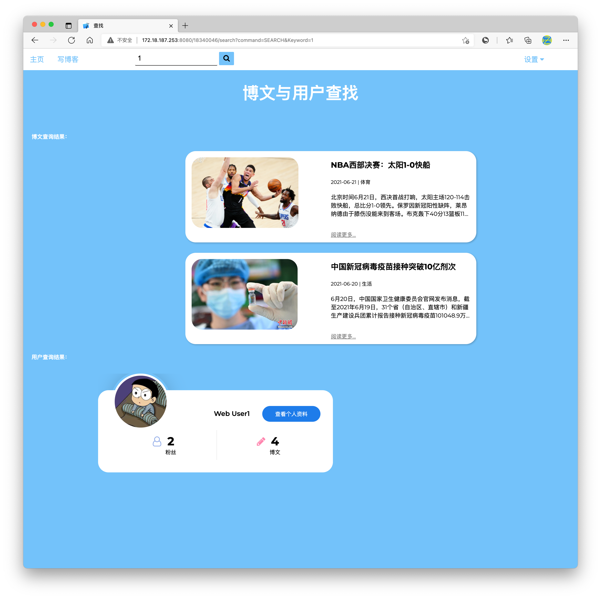
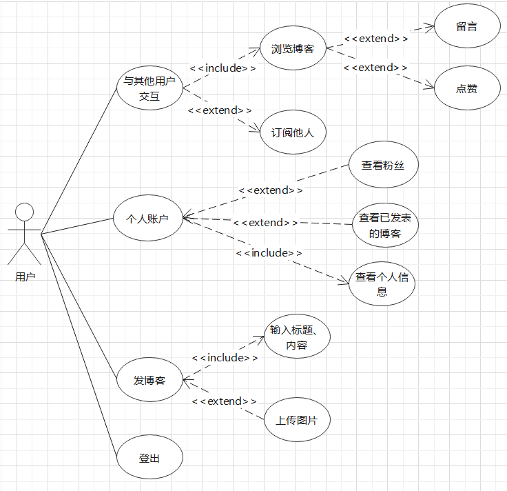
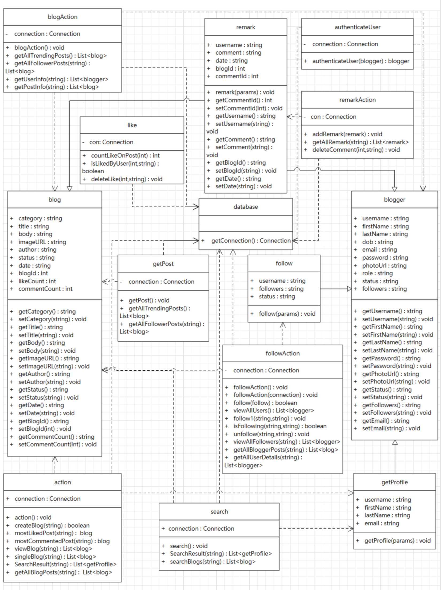

# MyBlog

This is a web project which uses only html+css+jsp+js+java, in the other words, this is a blog website without using any framework.

Here are some screenshots:

And here are some pictures of the architecture：

